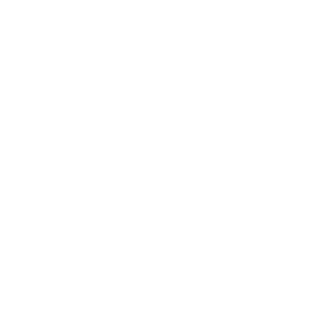

<h1 align="center">
    
</h1>

<h3 align="center">
  Trevalone: iOS Application
</h3>

<p align="center">“Não espere para plantar, apenas tenha paciência para colher”!</blockquote>

<p align="center">
  

  <a href="https://rocketseat.com.br">
    
  </a>

  

  

  <a href="https://github.com/IgorClemente/trevalone/stargazers">
    
  </a>

  
</p>

<p align="center">
  <a href="#rocket-descrição">Descrição</a>&nbsp;&nbsp;&nbsp;|&nbsp;&nbsp;&nbsp;
  <a href="#hammer-iniciando-a-aplicação">Iniciando aplicação</a>&nbsp;&nbsp;&nbsp;|&nbsp;&nbsp;&nbsp;
  <a href="#memo-licença">Licença</a>
</p>

## :rocket: Descrição

Aplicação principal

:heavy_minus_sign: [Aplicação Backend - NodeJS](https://github.com/IgorClemente/omnistack-week-challenge1)
:heavy_minus_sign: [Aplicação Web - ReactJS](https://github.com/IgorClemente/omnistack-week-challenge2)

## :computer: Tecnologias e Ferramentas

- [Swift](https://www.apple.com/br/swift/)
- [AWS SDK](https://aws.amazon.com/pt/tools/)
- [AWS Cognito](https://aws.amazon.com/pt/cognito/)
- [AWS DynamoDB](https://pixel.everesttech.net/4422/cq?ev_sid=3&ev_ln=dynamodb%20aws&ev_lx=kwd-64246267482&ev_crx=89108950468&ev_mt=e&ev_n=g&ev_ltx=&ev_pl=&ev_pos=&ev_dvc=c&ev_dvm=&ev_phy=1001773&ev_loc=&ev_cx=377183548&ev_ax=22645460548&ev_efid=Cj0KCQjw3qzzBRDnARIsAECmrypxkEEfyE6ayL9UOULa8z3L-ju5lIdCTRK5SmDPh0-ihDBApv3U9mgaAoItEALw_wcB:G:s&url=http://aws.amazon.com/dynamodb/%3Fsc_channel%3DPS%26sc_campaign%3Dacquisition_BR%26sc_publisher%3Dgoogle%26sc_medium%3Denglish_dynamodb_b%26sc_content%3Ddynamodb_e%26sc_detail%3Ddynamodb%2520aws%26sc_category%3Ddynamodb%26sc_segment%3D89108950468%26sc_matchtype%3De%26sc_country%3DBR%26s_kwcid%3DAL!4422!3!89108950468!e!!g!!dynamodb%2520aws%26ef_id%3DCj0KCQjw3qzzBRDnARIsAECmrypxkEEfyE6ayL9UOULa8z3L-ju5lIdCTRK5SmDPh0-ihDBApv3U9mgaAoItEALw_wcB:G:s)
- [AWS S3](https://pixel.everesttech.net/4422/cq?ev_sid=3&ev_ln=aws%20s3&ev_lx=kwd-20982008831&ev_crx=293625497751&ev_mt=e&ev_n=g&ev_ltx=&ev_pl=&ev_pos=&ev_dvc=c&ev_dvm=&ev_phy=1001773&ev_loc=&ev_cx=377181628&ev_ax=22645418188&ev_efid=Cj0KCQjw3qzzBRDnARIsAECmrypuUGy2s2O8zo5lk35Jj_bDey7guwgr8h1vUf-J0Z2hIYvcj1B9KxYaAjssEALw_wcB:G:s&url=https://aws.amazon.com/s3/%3Fsc_channel%3DPS%26sc_campaign%3Dacquisition_BR%26sc_publisher%3Dgoogle%26sc_medium%3DACQ-P%257CPS-GO%257CBrand%257CDesktop%257CSU%257CStorage%257CS3%257CBR%257CEN%257CText%26sc_content%3Ds3_e%26sc_detail%3Daws%2520s3%26sc_category%3DStorage%26sc_segment%3D293625497751%26sc_matchtype%3De%26sc_country%3DBR%26s_kwcid%3DAL!4422!3!293625497751!e!!g!!aws%2520s3%26ef_id%3DCj0KCQjw3qzzBRDnARIsAECmrypuUGy2s2O8zo5lk35Jj_bDey7guwgr8h1vUf-J0Z2hIYvcj1B9KxYaAjssEALw_wcB:G:s)
- [AWS Lambda](https://aws.amazon.com/pt/lambda/)

## :hammer: Iniciando aplicação

Para iniciar a aplicação, primeiro instale todas as dependências:

```bash

  yarn

```

Agora execute:

```bash

  expo start

```

Após executar, o Expo abrirá uma nova janela em seu navegador, contendo o espaço de Debug da sua aplicação, e um QRCode, caso você queira executar em um dispositivo real.

Para executar em um dispositivo real, é necessário baixar o aplicativo do Expo IO no seu device. Após isso faça a leitura do QRCode e espere carregar o `bundle` da aplicação.

Ele oferece opcões para executar em um simulador, `Android` ou `iOS`.

Também é possível executa-lo diretamente via terminal, executando o seguinte comando:

Para executar na plataforma `iOS`:

```bash

  yarn ios

```

ou `Android`:

```bash

  yarn android

```

## :memo: Licença

Esse projeto está sob a licença MIT. Veja o arquivo [LICENSE](LICENSE) para mais detalhes.

---

Projeto desenvolvido by Igor Clemente :wave:
